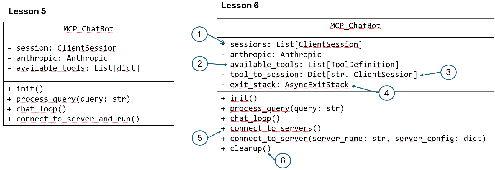
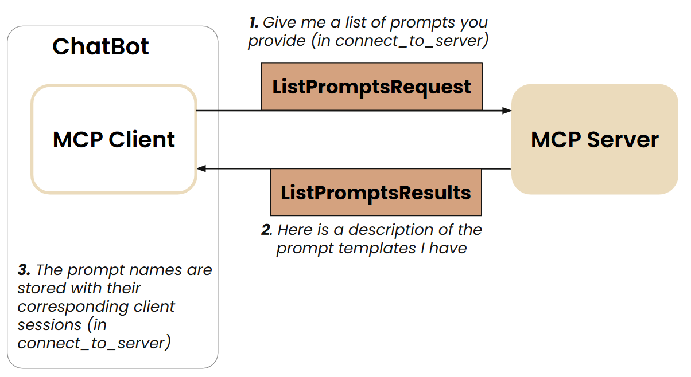

## Introduction

MCP is an open protocol that standardizes how applications provide context to large language models (LLMs).


## Why MCP


## MCP Architecture


## Creating an MCP Client and an MCP Server


### From Function Call to MCP


### Whole Picture





### Tools/Resources/Prompts Discovery and Invocation

<figure>


</figure>

<figure>


</figure>

<figure>


</figure>


### Client Source Code


```python
from dotenv import load_dotenv
from anthropic import Anthropic
from mcp import ClientSession, StdioServerParameters
from mcp.client.stdio import stdio_client
from contextlib import AsyncExitStack
import json
import asyncio
import nest_asyncio

nest_asyncio.apply()

load_dotenv()

class MCP_ChatBot:
    def __init__(self):
        self.exit_stack = AsyncExitStack()
        self.anthropic = Anthropic()
        # Tools list required for Anthropic API
        self.available_tools = []
        # Prompts list for quick display 
        self.available_prompts = []
        # Sessions dict maps tool/prompt names or resource URIs to MCP client sessions
        self.sessions = {}

    async def connect_to_server(self, server_name, server_config):
        try:
            server_params = StdioServerParameters(**server_config)
            stdio_transport = await self.exit_stack.enter_async_context(
                stdio_client(server_params)
            )
            read, write = stdio_transport
            session = await self.exit_stack.enter_async_context(
                ClientSession(read, write)
            )
            await session.initialize()
            
            
            try:
                # List available tools
                response = await session.list_tools()
                for tool in response.tools:
                    self.sessions[tool.name] = session
                    self.available_tools.append({
                        "name": tool.name,
                        "description": tool.description,
                        "input_schema": tool.inputSchema
                    })
            
                # List available prompts
                prompts_response = await session.list_prompts()
                if prompts_response and prompts_response.prompts:
                    for prompt in prompts_response.prompts:
                        self.sessions[prompt.name] = session
                        self.available_prompts.append({
                            "name": prompt.name,
                            "description": prompt.description,
                            "arguments": prompt.arguments
                        })
                # List available resources
                resources_response = await session.list_resources()
                if resources_response and resources_response.resources:
                    for resource in resources_response.resources:
                        resource_uri = str(resource.uri)
                        self.sessions[resource_uri] = session
            
            except Exception as e:
                print(f"Error {e}")
                
        except Exception as e:
            print(f"Error connecting to {server_name}: {e}")

    async def connect_to_servers(self):
        try:
            with open("server_config.json", "r") as file:
                data = json.load(file)
            servers = data.get("mcpServers", {})
            for server_name, server_config in servers.items():
                await self.connect_to_server(server_name, server_config)
        except Exception as e:
            print(f"Error loading server config: {e}")
            raise
    
    async def process_query(self, query):
        messages = [{'role':'user', 'content':query}]
        
        while True:
            response = self.anthropic.messages.create(
                max_tokens = 2024,
                model = 'claude-3-7-sonnet-20250219', 
                tools = self.available_tools,
                messages = messages
            )
            
            assistant_content = []
            has_tool_use = False
            
            for content in response.content:
                if content.type == 'text':
                    print(content.text)
                    assistant_content.append(content)
                elif content.type == 'tool_use':
                    has_tool_use = True
                    assistant_content.append(content)
                    messages.append({'role':'assistant', 'content':assistant_content})
                    
                    # Get session and call tool
                    session = self.sessions.get(content.name)
                    if not session:
                        print(f"Tool '{content.name}' not found.")
                        break
                        
                    result = await session.call_tool(content.name, arguments=content.input)
                    messages.append({
                        "role": "user", 
                        "content": [
                            {
                                "type": "tool_result",
                                "tool_use_id": content.id,
                                "content": result.content
                            }
                        ]
                    })
            
            # Exit loop if no tool was used
            if not has_tool_use:
                break

    async def get_resource(self, resource_uri):
        session = self.sessions.get(resource_uri)
        
        # Fallback for papers URIs - try any papers resource session
        if not session and resource_uri.startswith("papers://"):
            for uri, sess in self.sessions.items():
                if uri.startswith("papers://"):
                    session = sess
                    break
            
        if not session:
            print(f"Resource '{resource_uri}' not found.")
            return
        
        try:
            result = await session.read_resource(uri=resource_uri)
            if result and result.contents:
                print(f"\nResource: {resource_uri}")
                print("Content:")
                print(result.contents[0].text)
            else:
                print("No content available.")
        except Exception as e:
            print(f"Error: {e}")
    
    async def list_prompts(self):
        """List all available prompts."""
        if not self.available_prompts:
            print("No prompts available.")
            return
        
        print("\nAvailable prompts:")
        for prompt in self.available_prompts:
            print(f"- {prompt['name']}: {prompt['description']}")
            if prompt['arguments']:
                print(f"  Arguments:")
                for arg in prompt['arguments']:
                    arg_name = arg.name if hasattr(arg, 'name') else arg.get('name', '')
                    print(f"    - {arg_name}")
    
    async def execute_prompt(self, prompt_name, args):
        """Execute a prompt with the given arguments."""
        session = self.sessions.get(prompt_name)
        if not session:
            print(f"Prompt '{prompt_name}' not found.")
            return
        
        try:
            result = await session.get_prompt(prompt_name, arguments=args)
            if result and result.messages:
                prompt_content = result.messages[0].content
                
                # Extract text from content (handles different formats)
                if isinstance(prompt_content, str):
                    text = prompt_content
                elif hasattr(prompt_content, 'text'):
                    text = prompt_content.text
                else:
                    # Handle list of content items
                    text = " ".join(item.text if hasattr(item, 'text') else str(item) 
                                  for item in prompt_content)
                
                print(f"\nExecuting prompt '{prompt_name}'...")
                await self.process_query(text)
        except Exception as e:
            print(f"Error: {e}")
    
    async def chat_loop(self):
        print("\nMCP Chatbot Started!")
        print("Type your queries or 'quit' to exit.")
        print("Use @folders to see available topics")
        print("Use @<topic> to search papers in that topic")
        print("Use /prompts to list available prompts")
        print("Use /prompt <name> <arg1=value1> to execute a prompt")
        
        while True:
            try:
                query = input("\nQuery: ").strip()
                if not query:
                    continue
        
                if query.lower() == 'quit':
                    break
                
                # Check for @resource syntax first
                if query.startswith('@'):
                    # Remove @ sign  
                    topic = query[1:]
                    if topic == "folders":
                        resource_uri = "papers://folders"
                    else:
                        resource_uri = f"papers://{topic}"
                    await self.get_resource(resource_uri)
                    continue
                
                # Check for /command syntax
                if query.startswith('/'):
                    parts = query.split()
                    command = parts[0].lower()
                    
                    if command == '/prompts':
                        await self.list_prompts()
                    elif command == '/prompt':
                        if len(parts) < 2:
                            print("Usage: /prompt <name> <arg1=value1> <arg2=value2>")
                            continue
                        
                        prompt_name = parts[1]
                        args = {}
                        
                        # Parse arguments
                        for arg in parts[2:]:
                            if '=' in arg:
                                key, value = arg.split('=', 1)
                                args[key] = value
                        
                        await self.execute_prompt(prompt_name, args)
                    else:
                        print(f"Unknown command: {command}")
                    continue
                
                await self.process_query(query)
                    
            except Exception as e:
                print(f"\nError: {str(e)}")
    
    async def cleanup(self):
        await self.exit_stack.aclose()


async def main():
    chatbot = MCP_ChatBot()
    try:
        await chatbot.connect_to_servers()
        await chatbot.chat_loop()
    finally:
        await chatbot.cleanup()


if __name__ == "__main__":
    asyncio.run(main())
```


### SSE Remote Server Source Code

```python
import arxiv
import json
import os
from typing import List
from mcp.server.fastmcp import FastMCP

PAPER_DIR = "papers"

# Initialize FastMCP server
mcp = FastMCP("research", port=8001)

@mcp.tool()
def search_papers(topic: str, max_results: int = 5) -> List[str]:
    """
    Search for papers on arXiv based on a topic and store their information.
    
    Args:
        topic: The topic to search for
        max_results: Maximum number of results to retrieve (default: 5)
        
    Returns:
        List of paper IDs found in the search
    """
    
    # Use arxiv to find the papers 
    client = arxiv.Client()

    # Search for the most relevant articles matching the queried topic
    search = arxiv.Search(
        query = topic,
        max_results = max_results,
        sort_by = arxiv.SortCriterion.Relevance
    )

    papers = client.results(search)
    
    # Create directory for this topic
    path = os.path.join(PAPER_DIR, topic.lower().replace(" ", "_"))
    os.makedirs(path, exist_ok=True)
    
    file_path = os.path.join(path, "papers_info.json")

    # Try to load existing papers info
    try:
        with open(file_path, "r") as json_file:
            papers_info = json.load(json_file)
    except (FileNotFoundError, json.JSONDecodeError):
        papers_info = {}

    # Process each paper and add to papers_info  
    paper_ids = []
    for paper in papers:
        paper_ids.append(paper.get_short_id())
        paper_info = {
            'title': paper.title,
            'authors': [author.name for author in paper.authors],
            'summary': paper.summary,
            'pdf_url': paper.pdf_url,
            'published': str(paper.published.date())
        }
        papers_info[paper.get_short_id()] = paper_info
    
    # Save updated papers_info to json file
    with open(file_path, "w") as json_file:
        json.dump(papers_info, json_file, indent=2)
    
    print(f"Results are saved in: {file_path}")
    
    return paper_ids

@mcp.tool()
def extract_info(paper_id: str) -> str:
    """
    Search for information about a specific paper across all topic directories.
    
    Args:
        paper_id: The ID of the paper to look for
        
    Returns:
        JSON string with paper information if found, error message if not found
    """
 
    for item in os.listdir(PAPER_DIR):
        item_path = os.path.join(PAPER_DIR, item)
        if os.path.isdir(item_path):
            file_path = os.path.join(item_path, "papers_info.json")
            if os.path.isfile(file_path):
                try:
                    with open(file_path, "r") as json_file:
                        papers_info = json.load(json_file)
                        if paper_id in papers_info:
                            return json.dumps(papers_info[paper_id], indent=2)
                except (FileNotFoundError, json.JSONDecodeError) as e:
                    print(f"Error reading {file_path}: {str(e)}")
                    continue
    
    return f"There's no saved information related to paper {paper_id}."


@mcp.resource("papers://folders")
def get_available_folders() -> str:
    """
    List all available topic folders in the papers directory.
    
    This resource provides a simple list of all available topic folders.
    """
    folders = []
    
    # Get all topic directories
    if os.path.exists(PAPER_DIR):
        for topic_dir in os.listdir(PAPER_DIR):
            topic_path = os.path.join(PAPER_DIR, topic_dir)
            if os.path.isdir(topic_path):
                papers_file = os.path.join(topic_path, "papers_info.json")
                if os.path.exists(papers_file):
                    folders.append(topic_dir)
    
    # Create a simple markdown list
    content = "# Available Topics\n\n"
    if folders:
        for folder in folders:
            content += f"- {folder}\n"
        content += f"\nUse @{folder} to access papers in that topic.\n"
    else:
        content += "No topics found.\n"
    
    return content

@mcp.resource("papers://{topic}")
def get_topic_papers(topic: str) -> str:
    """
    Get detailed information about papers on a specific topic.
    
    Args:
        topic: The research topic to retrieve papers for
    """
    topic_dir = topic.lower().replace(" ", "_")
    papers_file = os.path.join(PAPER_DIR, topic_dir, "papers_info.json")
    
    if not os.path.exists(papers_file):
        return f"# No papers found for topic: {topic}\n\nTry searching for papers on this topic first."
    
    try:
        with open(papers_file, 'r') as f:
            papers_data = json.load(f)
        
        # Create markdown content with paper details
        content = f"# Papers on {topic.replace('_', ' ').title()}\n\n"
        content += f"Total papers: {len(papers_data)}\n\n"
        
        for paper_id, paper_info in papers_data.items():
            content += f"## {paper_info['title']}\n"
            content += f"- **Paper ID**: {paper_id}\n"
            content += f"- **Authors**: {', '.join(paper_info['authors'])}\n"
            content += f"- **Published**: {paper_info['published']}\n"
            content += f"- **PDF URL**: [{paper_info['pdf_url']}]({paper_info['pdf_url']})\n\n"
            content += f"### Summary\n{paper_info['summary'][:500]}...\n\n"
            content += "---\n\n"
        
        return content
    except json.JSONDecodeError:
        return f"# Error reading papers data for {topic}\n\nThe papers data file is corrupted."

@mcp.prompt()
def generate_search_prompt(topic: str, num_papers: int = 5) -> str:
    """Generate a prompt for Claude to find and discuss academic papers on a specific topic."""
    return f"""Search for {num_papers} academic papers about '{topic}' using the search_papers tool. 

    Follow these instructions:
    1. First, search for papers using search_papers(topic='{topic}', max_results={num_papers})
    2. For each paper found, extract and organize the following information:
       - Paper title
       - Authors
       - Publication date
       - Brief summary of the key findings
       - Main contributions or innovations
       - Methodologies used
       - Relevance to the topic '{topic}'
    
    3. Provide a comprehensive summary that includes:
       - Overview of the current state of research in '{topic}'
       - Common themes and trends across the papers
       - Key research gaps or areas for future investigation
       - Most impactful or influential papers in this area
    
    4. Organize your findings in a clear, structured format with headings and bullet points for easy readability.
    
    Please present both detailed information about each paper and a high-level synthesis of the research landscape in {topic}."""

if __name__ == "__main__":
    # Initialize and run the server
    mcp.run(transport='sse')
```


## Reference

[DeepLearning.AI - MCP: Build Rich-Context AI Apps with Anthropic](https://learn.deeplearning.ai/courses/mcp-build-rich-context-ai-apps-with-anthropic)

[MCP official documentation](https://modelcontextprotocol.io/docs)