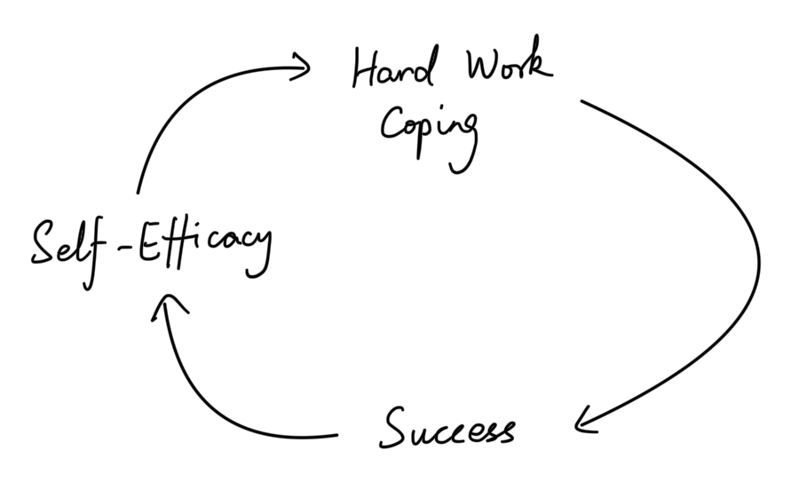

## Content

1. Introduction

2. Premises

3. Beliefs

4. Focus

5. Change

6. Goal Setting

7. Perfection

8. Health

9. Relationship

10. Self-esteem
11. Final

## Introduction

### Extraordinary successful students of Harvard MBAs

1. **They really believe in themselves. The sense of confidence.**
   - They thought they could do well. They were driven. They were motivated. They thought "I'm going to make it, I'm going to succeed."
2. **They were always asking questions.**
   - Always asking questions, initially of their boss, later of their employees, of their partner, children, parents, friends, they were always asking question. They are always at the state of curiosity, always looking up, opening up, wanting to understand the world more. They didn't say "Now I have my MBA. That's it. I know enough." They were life-long learners. They were always asking questions.

### Change

Change is the most important thing. Do work your talk. Give a due time to write down your change, so that you need to change before that time.

### Find "fit"

You would be exposed to many theories and many ideas in this class. Not everything will be right for you. You'll be exposed to it, you'll try it, and then you'll make up your mind "Yes, this is what I want to incorporate." or "No, this is just not relevant for me."

## Premises

### The permission to be human

Active acceptance.

Understanding certain things I cannot change, and certain things I can and ought to change.

> God, grant me the serenity to accept the things I cannot change, the courage to change the things I can change, and the wisdom to know the difference.
>
> -- <cite>Reinhold Niebuhr</cite>

The A, B, C of psychology:

- Affect: emotion
- Behavior: action
- Cognition: thoughts

Affect is there, just like the law of gravity is there. That does not mean we need to accept our behavior and our cognition.

For example, I can envy toward my best friend, but that does not make me a bad person. It's human. Envy is part of human nature. Nothing good or bad about the envy (affect / emotion). The question is how do I choose to behave, to act as a result of it. I can have moral or immoral behavior toward my best friend. I can still experience envy toward my best friend, and choose to behave generously and benevolently toward him. The same with the cognition.

I can feel the certain way (affect / emotion), but it doesn't mean that I need to resign to my thoughts about the feeling.

As for experience, meditation is a great way to experience the permission to be human.

- Shift the focus of your thought to your breathing.
- Repeat deep breath.
- Shift your focus to your emotions, to your feelings. Whatever they are, allow it to flow through you naturally. It's all okay, just breathe.

> Hint: The meditation is at the last part of lecture 4.

### Negative loop and positive loop

- Negative loop
  - Narrow and constrict, sadness.
  - Narrow: focus on the one sad thing and ignore all others.
  - Negative loop makes depression.

- Positive loop
  - Broaden and build, positive emotions.
  - Look broadly,  look to other people, look to other things.
  - A positive emotion can take us out of a downward spiral, and create a upward spiral.

### Moral question about pursuing happiness

People feel guilty about pursuing their own happiness. People feel guilty at times feeling good about themselves. But we should not.

Happiness is a positive-sum game. Happiness is contagious. If I am happier, I am more likely to contribute to other people's happiness and well-being. It feels good to feel good. It also contributes to others to feel good.

## Beliefs

### The secret of success

Optimism, passion and hard work.

### Happiness and self-esteem

**Coping rather than avoidance.**

1. **Self perception theory.** 
   - We derive conclusions about ourselves in the same way we derive conclusions about others.
   
   - For example, if I see a person going up to people and initiating a conversion, or speaking up in section, or trying out for plays and trying again and again. My conclusion about this person -- "This person is courageous. This person must have a high self-esteem." And I derive the conclusion about myself in exactly the same way. By seeing myself behave in a certain way, I reach a conclusion about my self-esteem or benevolence or generosity or whatever it is.
   
2. **Realizing the pain of actual failure.** 
   - When we fail after coping, we realise the actual pain that comes with failure is far less than the pain that we imagine and that we associate with failure.
3. **More success.**
   - When I realized that the pain of actual failure is far less than the pain associated with the failure, I become more confident -- "hey I can handle it". I'm actually much more resilient than I thought I was. And my self-esteem increases. My happiness as a result increases too. And finally there is more success, because there is no other way to succeed. Learn to fail, or fail to learn.

### How to become an optimist

1. **Just do it! (Action)**

   

   - Hard work and coping inevitably leads to success. Even a little success contributes to our self-efficacy, to our self-confidence. And then, the self-confidence in turns motivate us to work harder. We start to believe in ourselves more.
   - To fail more. Because there is no other way to succeed, there is no other way for growth. To dare is to lose one's footing momentarily, not to dare is to lose oneself. If we constently avoid challenges, if we don't give us permission to fail,  a downward spiral is created, in terms of our self-esteem, in terms of our success, in terms of our well-being.

2. **Imagine that (Visualization)**

   - My mind doesn't know the difference between the real thing and the imaginary thing, and what the brain doesn't like is inconsistency. If I imagine success over and over again in my mind,  my brain will bring up the external reality to match the internal schema.
   - The key is not just focus on the destination. Visualize the journey as well as the destination.
   - Make the imaginary as real as possible as by involving as many senses as we can.

3. **Cognitive therapy (Rational thinking)**

   

   - Thoughts drive emotion. If we want to change emotions, where we need to intervene is evaluation. If we change that, we also change out emotion.
   - Sometimes our thoughts are irrational, which led to a difficult emotion. For example, I don't do well in one test, and immediately I classify myself stupid, or that I will never succeed in tests again, and that led to resignation emotion. What cognitive therapy does is to restore that rationality: "Yeah, it hurts, it's tough, but, you know, there are 3200 other men at Harvard".
   - 3Ms
     - Magnifying, exaggerating something that happens. For example, I did poorly in the midterm -> I'm not smart, I can't succeed. Over generalization, irrational evaluation/ thought.
     - Minimizing, tunnel vision. For example, 618 students engaged, 2 students asleep, but I only focus on these 2 students and think my class is boring. we need to zoom out from it, and see the whole picture .
     - Making up, or fabricating. For example, an abused wife would very often say, "It's my doing, it's my fault, I'm not behaving appropriately" instead of rational saying "This guy is abusive, I'm out of here". Don't over personalize or over blame, just be real.

TBC...

## Reference

- [Bilibili - 【哈佛大学公开课】幸福课（积极心理学）【心理学】](https://www.bilibili.com/video/BV1kx411S7ZU)
